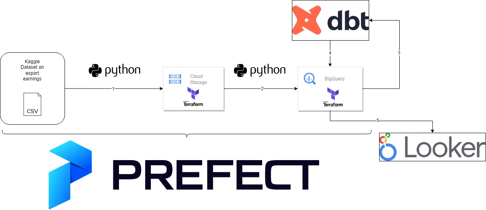
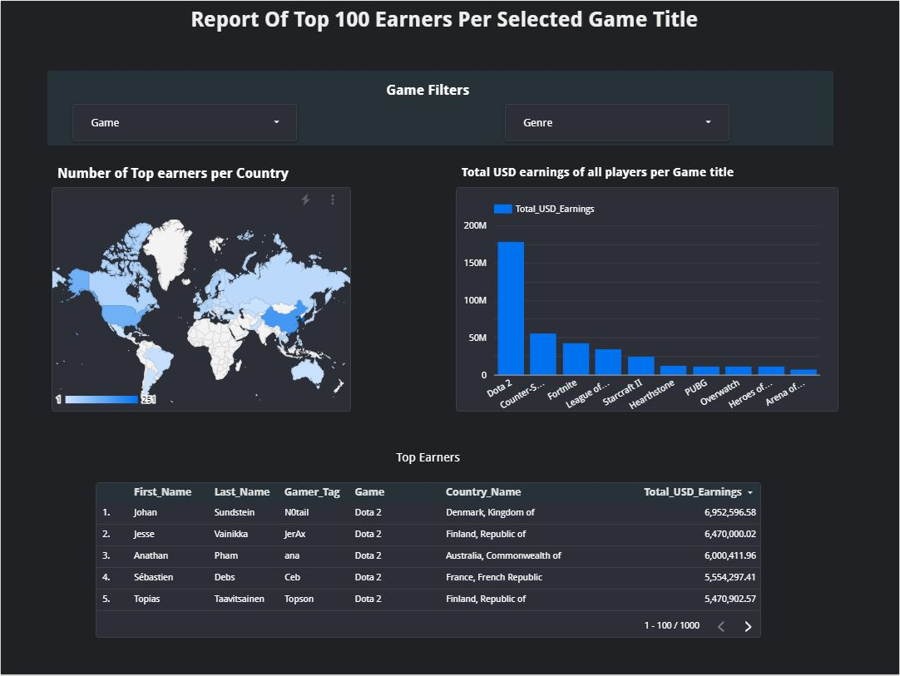

## Project Description / Problem Description
Ask any young child what they want to do when they grow up and you'll find that, in some cases, the answer will be to play video games or to become a content creator.  In today's day and age it's not uncommon for young (or even older) individuals to pursue a career in the video game industry.  Playing video games professionally is one way to make a living, but unfortunately, just like any other sport/activity, you'll need to be one of the best players in the world to make it to the professional gaming scene called Esports. Esports , short for electronic sports, is a form of competition using video games.  Esports often takes the form of organized, multiplayer video game competititons, particularly between professional players, individually or as a team.


The aim of this project is to give the user insight on the possibilities of: 1. The financial gain by playing video games in a professional manner and 2.  To indicate to the user, which might still be deciding on a game to participate in, which games on the e-sports scene is the most rewarding by looking at the top earnings per game and game genre and 3.  Provide the user with a geographical distribution of the top earners for these specific games/genres in order provide insights on which regions are more likely to support specific games in the competitive scene.  

The project will gather, process and display esport earnings data of the top 100 earners for ten specific games found in the esport scenery.  More information on the data gathering, processing and displaying steps are discussed further in this document.

## Data set
The data that will be used for this project can be found on kaggle.com - [LINK](https://www.kaggle.com/datasets/jackdaoud/esports-earnings-for-players-teams-by-game).  The main two files we are interested in are the following:
* highest_earning_players.csv
    * Provide the player's detail and the game the player plays.
* country-and-continent-codes-list.csv
    * Provide the geographical information that can be linked to the player's country code

The final dashboard can be viewed by opening this [LINK](https://lookerstudio.google.com/s/sBzaz4soa7I)

## High level project design and workflow description
The puprose of this section is to illustrate the data pipeline architecture of this project via the following image:





The pipeline architecture is as follows:
1.  The data set, found on kaggle.com, are downloaded, processed and stored on Google Cloud Storage via Python (orchestrated by Prefect)
2.  The data set on Google Cloud Storage is imported into Google Biq Query (GBQ) and located in the staging_project_data data set.  This is done via Python (orchestrated by Prefect)
    1.  A SQL script is executed in GBQ in order to optimize the newly added data by making use of clustering.
    2.  Note that no partitions are needed in this case as there is no date values in the data set - hence we are only making use of clustering.
3.  DBT uses the staging data in GBQ to build the applicable views and production data sets that will be used for dashboarding.
4.  DBT stores the newly created production data sets in GBQ (production_project_data data set)
5.  The dashboard is created in Looker Studio and displays the data found in the production_project_data data set.


## Technologies used:
* Code: Python
* Terraform
    * Infrastructure code that provisions:
        * Google Cloud Storage Buckets
        * Google Big Query Data Sets
* Google Cloud Platform
    * Google Cloud Storage (storing raw data files)
    * Google Big Query (Data Warehouse)
        * Table optimization done by means of clustering (there is no need for partitioning in this case)
* Prefect
    * Orchestrator tool for the data pipeline
* DBT
    * Data transformation and deployment into the production warehouse data set
* Data Visualization
    * Looker Studio

## Recreating the data pipeline 
This section will allow the user to create and run the data pipeline.
Please note that this project was developed in Windows OS.  Any other OS might require an alternative approach

### 1. Creating Google Cloud Platform (GCP)
The project pipeline is making use of Google Cloud Platform.  In order for the user to replicate the pipeline, they'll need to set up a GCP environment.  
*  The first step in the process is for the user to create a GCP account (if they have not done so already).  This can be done by following the steps in this [LINK](https://www.googleadservices.com/pagead/aclk?sa=L&ai=DChcSEwjJ46z7nYv-AhURpLIKHROYA1EYABAAGgJscg&ohost=www.google.com&cid=CAASJeRojfEdEgjhUdavw-D6EgMxjah19w2TX2qQ3r70Et_NIAuN_L0&sig=AOD64_3k4xtbQ41NOlfBdXDrxSAO3RdG-A&q&adurl&ved=2ahUKEwiG6aT7nYv-AhX9QvEDHZlUD0gQ0Qx6BAgKEAE).
*  After the user has created an account, the user will need to create a new project (Steps can be found [HERE](https://cloud.google.com/resource-manager/docs/creating-managing-projects)).  It is important to take note of the project ID as this information will be needed at a later stage.
*  The next step for the user is to create a service account.  This can be done by following these [STEPS](https://cloud.google.com/iam/docs/service-accounts-create)
*  For the purpose of this project the service account user will be granted the Editor role.  Please note that this is not best practice and is only used for the purpose of this project.
*  The next step is for the user to generate keys for the service account that was created.  In order to do this the user needs to navigate to IAM and admin -> Service accounts, select the service account that was created, navigate to KEYS -> ADD KEY -> Create new key -> JSON -> Create.  Please store this key somewehere safe as you'll be making use of it at a later stage.  It is also important to note that this key is not to be shared with anyone.
* Install the Google SDK by using this [LINK](https://cloud.google.com/sdk/docs/install-sdk) for instructions.
* Authenticate the Google SDK by running the following code in your computer terminal:
~~~ 

export GOOGLE_APPLICATION_CREDENTIALS=<path_to_your_credentials>.json
gcloud auth activate-service-account --key-file $GOOGLE_APPLICATION_CREDENTIALS
gcloud auth application-default login

~~~

### 2. Terraform And Provisioning Of GCP Resources
This section assist the user in running the terraform code to set up the GCP resources.

* The first step for the user is to make sure that Terraform is installed.  The user can make use of these [STEPS](https://phoenixnap.com/kb/how-to-install-terraform) to ensure that Terraform is installed and ready to be used.
* The next step for the user is to clone this git repo to their local machine.
* Copy the service account's JSON credential file into the "Terraform" folder and name it "gcs_service_acc.json"
* Navigate to the Terraform folder and edit the "variables.tfvars" file with the following:
    * project = #Enter your project id here
* The user can now make use of the CLI.  Navigate to the Terraform folder and run the following commands:
~~~
terraform init
terraform plan -var-file variables.tfvars
terraform apply -var-file variables.tfvars
~~~

After the code completed successfully, the user will have the following infrastructure set up in GCS:
* Google Cloud Storage bucket
    * name: project_data_bucket_{your project id here}
* Google Big Query Data Sets
    * production_project_data 
    * staging_project_data
* Please note that these resources are created in the europe-west6 zone.

## 3. Python Environment Setup
This section will assist the user in setting up a python environment in order to run the python scripts in the data pipeline.

The easies (and recommended) way to run the python code is to set up an environment to run the code in.  The user can make use of any method that works for them.  The approach I followed was creating a virtual environment by making use of anacondas with the following steps:
1.  Run "conda create --name project python=3.9" in order to create the environment.
2.  Install pip into the environment by running: "conda install -n project pip"
3.  Run prefect config set PREFECT_API_URL=http://127.0.0.1:4200/api in the command line interface
4.  Activate the envirionment by running: "conda activate project"
5.  Install the packages required: pip install -r requirements.txt  (the requirements.txt file can be found under the requirements folder in this repo)

## 4. Prefect Setup
It is important to note that the user needs to complete section 3 before attempting this step as Prefect is installed via the pip install command.
It is also important for the user to note that all code from here onwards need to be run in the newly created environment.

This section will focus on accessing the Prefect GUI and allowing Prefect to integrate with GCP.

In the terminal (of the newly created environment) the user shoud run ``` prefect orion start ```.  This will allow the user to access the GUI by navigating to http://127.0.0.1:4200/ (note that port forwarding might be needed if you are not able to view the GUI).  
* The user can now make use of the GUI and navigate to the blocks section.
The user will create the following blocks in Prefect in order to allow Prefect to seamlessly integrate with GCP.  
   * GCP Credentials  
      * You'll need to provide the JSON key that you generated for your GCP service account
      * Name the block "gcp-project-service-account" for the purpose of this document
   * GCS Bucket 
      * Name the block "data-engineering-project" for the purpose of this document

## 5. Accessing Kaggle dataset
One last step that the user needs to complete before running the project pipeline code is to create an account on kaggle.com in order to access the data set.
* Navigate to [KAGGLE](https://www.kaggle.com/) and create an account
* Navigate to your profile -> Account -> API -> Create new API Token -> Save the generated file.
* Ensure kaggle.json is in the location ~/.kaggle/kaggle.json in order to access the data set via the API.

## 6. Running the Python code
The user can now start to run the code in the pipeline in order to download the data set from Kaggle and upload it to GCS and GBQ.

Navigate to the code folder and run the following python scripts:
``` python ingest.py ```
This code will do the following:
   * Download 3 files from the data set into a subfolder called "input"
   * Upload the files to GCS bucket with the following folder setup: bucket/raw_data/esport_earnigns/{files}
   * Note that only 'highest_earning_players.csv' and 'country-and-continent-codes-list.csv' will be uploaded as these are the files that will be used in the project
   *  Run ``` python gcs_to_gcbq.py ```
This code will do the following:
   * Load the GCS data into GBQ with the following structure
   * Data set: staging_project_data
   * Tables: 
      * country_codes
      * player_earnings

## 7. Optimizing GBQ tables
The next step in the process is for the user to optimize the newly tables created in GBQ.
* Navigate to the code/sql folder in the repo and run the sql code found in "country_codes_optimized.txt" and "player_earnings_optimiszed.txt"
* The user will see that 2 new tables are created in the the staging_project_data data set
   * country_codes_optimized
   * player_earnings_optimized
* The tables are optimized by making use of clustering.  Please take note that partitioning was not used in this case as there are no date fields.


## 8. Data Transformation in DBT
In order to perform the next steps, the user will need a DBT account.  If not, the user can sign up [HERE](https://www.getdbt.com/signup/)

* Create a new project and connect it to Google Big Query
   * Keep your GCP project id and serivce account file close by as you'll need to for this step.
* In the DBT develop tab you can connect to the project created and stored in this repo.  (https://github.com/NobleNooblet/DE_Zoomcamp_Project/tree/main/dbt)
* Now the user needs to set up the "Production" deployment step.
   * In DBT online, navigate to Deploy -> Envvironments -> Create Environment.
   * Name the Environment "Production"
   * Enter the following dataset: production_project_data -> save.
* Navigate to Deploy -> Jobs -> Create Job
   * Choose the production environment and ensure that the following two commands are listed in the job:
      * dbt build --select +earnings_data
      * dbt run 
   * Save the job
* Navigate to Deploy -> Jobs and choose the job that you just created and run the job (via "Run Now")
* When the job executed successfully you'll see the following tables/views created in GBQ under the "production_project_data" data set.
   * country_codes_view
   * player_earnings_view
   * earnings_data
      * This is the table that will be used in the dashboard.
## 9. Data visualization
The user can make use of any data visualization tool of their choice to access the newly created table with its data.  Google Looker Studio was used in this case and it was set up to access the "earnings_data" table in the "production_project_data" data set in Google Biq Query.

The final dashboard can be viewed by opening this [LINK](https://lookerstudio.google.com/s/sBzaz4soa7I)

Here's an example of the dashboard that was built:


## 10.  Closing Remarks
I would like to thank the DataTalks.Club group for providing me with enough knowledge to have a better understanding in building a data pipeline with various different tools and also providing insights on how they interact with eachother.
With all this added knowledge...who knows what the future holds... Till next time.

